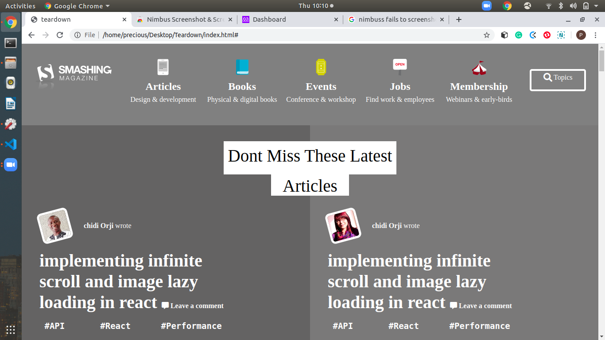

# Design Teardown

This is a collaborative project about building a webpage's heatmap using grey scale.

It was done to identify sizes and positions occupied by every element on the webpage

It is a grey replica of the smashingmagazine.com

Additional description about the project and its features.

# Built With

-HTML & CSS

## Live Demo

[Live Demo Link](https://raw.githack.com/evabanegacom/Teardown/teardown/index.html)

# Prerequisites
Visual Studio code editor

# Authors

👤 **Precious**

- Github: (https://github.com/evabanegacom)
- Linkedin:(https://www.linkedin.com/in/precious-udegbue-a3468314a/)

👤 **Samuel**

- Github: (https://github.com/Samitti)
- Linkedin: (https://www.linkedin.com/in/samuel-ghebremeskel-29685811a/)

# 🤝 Contributing
Contributions, issues and feature requests are welcome!

Feel free to check the issues page.

Show your support
Give a ⭐️ if you like this project!

# Acknowledgments

smashing magazine

etc
📝 License
This project is MIT licensed.